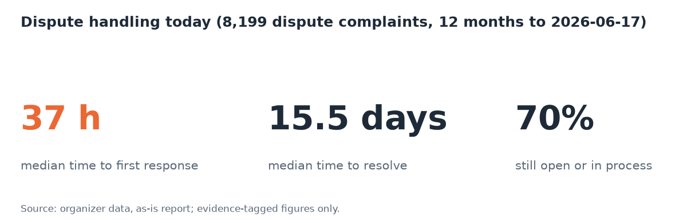

# LATAM Bank: an AI dispute desk that has to earn the right to act

Factored AI & Data Hackathon 2026. One workflow, built end to end: **account and payment inquiries plus transaction-dispute
intake**, in Spanish and Portuguese, for a synthetic LATAM bank. Code decides every route and enforces identity, permissions
and the dispute policy. Typed judgments (Jev) decide the bounded questions. A language model only turns text into JSON and
writes the reply. Each step of a turn (tool call, judgment, policy check, action, refusal, handoff) is written as a
decision record you can open in the trace view; the write is best-effort (see Limitations).

> This is a deployed workflow prototype with inspectable controls, not a production system. Identity is a mock IdP, the
> resolver is trained on simulated cases, and bank integration and operational validation remain (see
> [Limitations](#limitations-and-before-production)).

## Try it

- **App:** `{{APP_URL}}` (set at submission)
- **Customer chat:** `/login`. The 20 demo identities (`demo01`–`demo20`) are listed on the page, and their password and code
  are filled in for you. `demo01`–`demo08` are each tagged with a demo scenario. Portuguese speakers: `demo04`, `demo08`,
  `demo12`, `demo16`, `demo20` (pick Português on the login page).
- **Staff console:** `/login?staff=1`, then `/agent` for the handoff queue, `/trace/<session>` for the decision trace and
  `/demo` for the guided stage. Staff credentials are not published; they are in the submission email.
- **Demo stage (`/demo`):** a phone frame, the live trace and 8 one-click scenarios: ES inquiry, PT decline explanation, ES
  dispute filed, ambiguous → clarification, unsupported → abstain, unauthorized charge → human handoff, prompt injection
  refused, expired session.

## The problem, in the bank's own numbers

From the as-is diagnosis of the organizer data ([`reports/asis-2026-10-05.md`](reports/asis-2026-10-05.md), window
2025-06-17 → 2026-06-17). Every figure there is tagged **evidence** or **synthetic artifact**, and artifacts are never used
as an argument.

| Finding | Value | Tag |
|---|---|---|
| Dispute complaints (Cargo no reconocido, Cobro indebido) | 8,199 | evidence |
| Median time to first response on a dispute | **37.0 h** (n=5,022) | evidence |
| Median time to resolve a dispute | **15.5 days** (n=1,886) | evidence |
| Disputes still Open or In Process | **69.8 %** (n=8,199) | evidence |
| Disputes arriving by call center | 50.7 % | evidence |
| Non-first-contact-resolution contacts per 100 contacts: Queja vs Transaccional | **9.6 vs 2.9** (17.1 % × (1 − 0.436) vs 34.9 % × (1 − 0.916)) | evidence |
| In-scope contacts per month (Transaccional + disputes) | 7,372 | evidence |
| Phone share of all contacts | 85.0 % | evidence |

**Where the pain is.** Transaction inquiries are already resolved at first contact 92 % of the time; automating them alone
would not move much. The pain is dispute intake: 37 hours before anyone answers and 70 % of cases still open. This system
takes a dispute from the first message to a filed, read-back-verified record in one conversation, or to a complete,
structured handoff packet when a human must decide. Transaction inquiries are in scope because a dispute needs them: you
can't dispute a charge you can't find.

**What success looks like.** Measurable targets, each tied to a metric the evaluation reports with its denominator:

| Target | Today | Measured by |
|---|---|---|
| Dispute intake: median ≤ 5 min from the customer's first message to a filed, read-back-verified record, in one conversation | 37 h median to a *first response* (a different endpoint: today nothing is filed by then) | `decision_records`: time from the first turn to `verify:tool` |
| Unsafe outcomes: 0 observed, reported as k/N with the upper confidence bound, never as "zero risk" | — | eval classifier, unsafe outcomes over all in-scope cases |
| 100 % of human handoffs arrive as a complete `handoff.v1` packet (request, verified facts, actions, evidence, open questions) | free-text complaints | packet schema validation + eval judge |
| Safe automated resolution of in-scope inquiries and eligible disputes: target set after a pilot; we report the rate with its CI | — | eval, safe automated resolution over all in-scope cases |
| Wrong-transaction disputes ≤ 2 % at the resolver's threshold (**measured: 1 of 150 = 0.7 %, exact 95 % CI 0.02–3.7 %, so ≤ 2 % is not yet shown; P equals B2 on this**) | — | resolver evaluation on the frozen human-written test set |

**What we don't claim.** That customers want chat (85 % of contacts are phone today), any savings figure, or improvement
over the legacy process. Those need a pilot.

## What it does

| Case type | Example | What happens |
|---|---|---|
| Automated resolution | "¿Cuál es el saldo de mis tarjetas?", "Por que meu pagamento foi recusado?" | Read tools scoped to the session's customer, then a reply checked against the receipts |
| Ambiguous or unsupported | "Tengo un problema con un pago", "quiero un préstamo" | Clarification with options (at most 2 rounds), or an abstain message plus an offer of a human |
| Human required | Unauthorized charge, amount over 500 USD, fraud score over 30, legal threat, repeated injection | A structured `handoff.v1` packet (request, verified facts, actions taken, evidence, open questions) in the staff queue; a person can take over the chat |
| Dispute filed | "Me cobraron dos veces en Netflix" | A summary card built in code, then a confirmation, a policy re-check inside the write tool, a conditional write and a read-back |

## Architecture

| Layer | What | Where |
|---|---|---|
| Data | Organizer S3 drop → Snowflake `RAW` → dbt `STAGING` (typed, deduplicated, quarantined) → `CURATED` (enforced contracts) → versioned parquet + `latest.json` pointer | [`docs/data-pipeline.md`](docs/data-pipeline.md), `dbt/`, `pipeline/`, [`docs/diagrams/pipeline.svg`](docs/diagrams/pipeline.svg) |
| Agent | LangGraph workflow on Amazon Bedrock AgentCore Runtime (JWT authorizer). LLM: `mistral.ministral-3-14b-instruct` (extract) and `openai.gpt-oss-120b` (compose) on Bedrock. Typed decisions: Jev (`jev-1.13.0`) | `agent/`, [`docs/diagrams/agent-core.svg`](docs/diagrams/agent-core.svg) |
| State | DynamoDB: checkpoints, disputes, handoffs, decision records, sessions, conversation messages | `infra/terraform/data/` |
| Web | Next.js customer chat, staff console, trace view and demo stage; the BFF holds the token in an httpOnly cookie | `web/`, [`docs/diagrams/ui-architecture.svg`](docs/diagrams/ui-architecture.svg) |
| Realtime | AppSync Events: per-session channels, the handoff queue and live trace stages; a Lambda authorizer allows a customer only their own session | `infra/realtime/` |
| Identity | Mock OIDC IdP on Lambda (RS256, JWKS); the customer id lives in the token, never in a message | `agent/src/bankagent/identity/` |
| Infra | Terraform roots `bootstrap`, `platform`, `data`, `identity`, `realtime`, `agent`, `app`; GitHub Actions via OIDC, no stored secrets | `infra/terraform/` |

**How a turn works.** The BFF forwards the message with the customer's bearer token. AgentCore checks the JWT, and the agent
checks it again. The agent extracts details (LLM → JSON), asks Jev the bounded questions (intent, which of *your*
transactions, confirm?, injection?), and code picks the next node from those answers and the YAML policy. Read and write
tools run under the token's customer id and scopes. The reply is drafted by the LLM from the receipts, checked by a code
guard for foreign ids, and verified by Jev; if it fails twice, a fixed template is used. Each step is written to
`decision_records` and pushed to the trace view.

## Controls: where each one is enforced

Code and YAML make the decisions. Jev thresholds bound the judgments. Prompts only shape wording.

| Control | Enforced in | Proven by |
|---|---|---|
| Customer id comes only from the verified JWT `sub`, never from the message or body | Code: `agent/src/bankagent/auth/tokens.py:47-56`, `agent/src/bankagent/app.py:51-63`; BFF body schema `web/app/api/chat/route.ts:10-16` | `test_app.py::test_payload_customer_id_is_ignored`, `::test_tampered_token_rejected`, `::test_expired_token_reports_session_expired_in_requested_language` |
| Every read is scoped to the session's customer; a foreign record and a missing one return the same `NotFound` | Code: `agent/src/bankagent/tools/read.py:20-24,51-83` | `test_read_tools.py::test_foreign_and_missing_transactions_are_indistinguishable`, `::test_accounts_only_own`, `::test_scope_required` |
| Filing a dispute re-checks scope, ownership and the policy inside the tool | Code + YAML: `tools/write.py:52-60`, `policy/dispute_policy.yaml`, `policy/dispute.py:60-97` | `test_write_tools.py::test_foreign_transaction_is_not_found`, `::test_declined_rejected_by_policy_and_not_written`, `test_policy.py` |
| Filing needs a confirmation (Jev p ≥ 0.90) on a summary card built in code, and the "yes" is bound to that card: a hash of its contents is re-checked against the freshly read record before writing | Jev threshold + code: `decisions/thresholds.v1.yaml:22`, `decisions/routing.py:212`, `graph/nodes.py` (`_card_hash`, `file_dispute`) | `test_routing.py::test_confirmation_outcomes`, `test_graph_paths.py::test_dispute_confirm_file_verify`, `::test_confirmation_is_bound_to_the_card_the_customer_saw` |
| No duplicate disputes; an unknown write outcome is settled by a read-back, not a blind retry | Code + DynamoDB: conditional put `store/repos.py:21`, read-back `tools/write.py:73-89` | `test_write_tools.py::test_unknown_write_outcome_resolved_by_read_back`, `test_graph_failures.py::test_duplicate_dispute_is_not_filed_twice` |
| Replies can't mention ids the customer doesn't own; claims are verified; one regeneration, then a template | Code + Jev: `guards.py:4-8`, `graph/nodes.py:618-651`, `decisions/verify.py` | `test_graph_failures.py::test_foreign_id_in_reply_is_blocked`, `::test_unverified_claims_regenerate_once_then_template` |
| Prompt injection is refused, then handed off; Jev only sees aliases of the customer's own candidates | Jev signal + code: `routing.py:157-180`, aliases `decisions/understand.py:94`, `routing.py:50` | `test_graph_failures.py::test_injection_refused_then_handed_off`, `test_decisions.py::test_request_uses_aliases_and_never_sends_ids` |
| The LLM has no tools; every graph edge is chosen in code | Code: `graph/build.py`, `llm/client.py` (JSON-schema output only) | `test_llm.py::test_compose_uses_json_schema_format_and_hides_fixed_block` |
| Human handoff for > 500 USD, fraud score > 30, unauthorized charges, legal threats | YAML + code: `dispute_policy.yaml:7-10`, `routing.py:121-154`, `handoff/packet.py` | `test_graph_paths.py::test_unrecognized_charge_drafts_dispute_and_hands_off`, `::test_legal_threat_hands_off_with_high_priority` |
| Runtime and realtime authorization | Infra + code: AgentCore `custom_jwt_authorizer` (`infra/terraform/agent/runtime.tf:20-29`); realtime rules (`infra/realtime/authorizer/rules.ts`): a customer subscribes only to `session/<own sid>` | `infra/terraform/agent/tests/agent.tftest.hcl`, `infra/realtime/test/authorizer.test.ts` |
| Staff credentials are never published | Code: `identity/app.py` `demo_users` returns customers only; the BFF returns `[]` for staff | `test_identity_ui.py::test_demo_users_only_in_demo_mode`, `web/tests/unit/auth-routes.test.ts` |

Paths without a prefix are under `agent/src/bankagent/` (code) or `agent/tests/` (tests).

## Failure behaviour (offline, deterministic fakes)

From `agent/tests/test_graph_failures.py`, `test_app.py` and `test_write_tools.py`. Each row is a test.

| Injected failure | What the customer sees | What is written |
|---|---|---|
| Jev down twice | A clarification, then a handoff notice | Handoff (`jev_unavailable`); no dispute |
| Jev down while the customer says "sí" | The summary card again | No dispute |
| Confirmation unclear 3 times | Asked again twice, then a handoff | Handoff (`confirmation_unclear`); no dispute |
| Same transaction disputed again in a new session | "Already disputed", with the existing reference | Still exactly 1 dispute |
| Injection attempt, twice | A refusal, then a handoff | Handoff (`injection_repeated`, high priority) |
| LLM compose fails | Template reply built from the receipts | Decision record `template` |
| Jev rejects the reply's claims | One regeneration, then the template | 2 drafts, 2 verifications |
| LLM puts another customer's transaction id in the reply | Template reply without it | Decision record `guard`; Jev never called |
| Serving data unavailable | "Can't access your information" + offer of a human | Nothing; Jev never called |
| Token without `dispute:create` | Abstain + offer of a human | No dispute |
| Turn budget spent | Template reply | Compose never called |
| Missing, expired or tampered token; JWKS unreachable | "Log in" / "session expired" / `identity_unavailable` | Workflow never runs |
| Write lands, then the call times out | Success with the same dispute id | Exactly 1 record |

Not covered end to end yet: a failed write turning into a handoff, and a read-back mismatch turning into a handoff (each is
unit-tested; the graph wiring is not).

## Capacity (not load-tested)

| Component | Limit we know of | Source |
|---|---|---|
| Web app | 1 Fargate Spot task (0.5 vCPU / 1 GB) behind a public ALB, plain HTTP; a Spot interruption means about 1–2 min of downtime while a new task starts, the URL stays the same | `infra/terraform/app/ecs.tf` |
| Agent runtime (AgentCore) | New sessions 25/s, data-plane calls 1,000/s (account quotas); each session runs in its own microVM | AWS Service Quotas, `bedrock-agentcore` |
| LLM (Bedrock Mantle) | Not visible: the on-demand quotas listed for gpt-oss and Ministral in our account read 0, and inference runs through the Mantle endpoint (and a role in a second account), whose throughput limits Service Quotas doesn't show | AWS Service Quotas, `bedrock` |
| Jev (TypeSafe) | No published rate limit; 3 s timeout per call, 2–3 calls per turn | `decisions/jev.py` |
| Identity (mock IdP) | API Gateway throttle 10 req/s (burst 20); the account's Lambda concurrency is 10 in total, shared with the realtime authorizer and publisher | `infra/terraform/identity/api.tf`, AWS account settings |
| DynamoDB | On-demand capacity, no provisioned limit | `infra/terraform/data/tables.tf` |

A demo with a handful of concurrent users fits these limits; a judge panel testing at once may hit the Lambda limit first
(a throttled login asks the user to retry). We have not measured where the system saturates.

## Data handling

**Data use.** The organizers confirmed that dataset records may be sent to Snowflake, Amazon Bedrock, TypeSafe (Jev) and the
evaluation persona provider. PII columns (names, document, birth date, contact details, address, credit score, income) never
leave Snowflake `RAW`, and product numbers are cut to the last four digits.

| Party | Receives | Where in code |
|---|---|---|
| Amazon Bedrock, via a role in a second AWS account (`040684487035`) | The customer message and the last 2 exchanges (extract); receipts with `customer_id`, `product_id` and fraud fields removed (compose, handoff open questions) | `llm/extract.py:65-67`, `llm/compose.py` (`redact`), `llm/client.py` (`BEDROCK_ROLE_ARN`) |
| Jev / TypeSafe (external) | `understand`: policy text, session facts, the message, and candidate transactions as aliases `c1..cN` (no transaction, customer or product id) | `decisions/understand.py:95-131` |
| Jev / TypeSafe (external) | `verify_reply`: the reply, its claims and the receipts with `customer_id`, `product_id` and fraud fields removed | `decisions/verify.py` (`REDACTED_FIELDS`); Jev calls are checked in the inquiry and dispute flows (`test_graph_paths.py`) |
| Evaluation persona model (OpenCode, offline eval only) | Synthetic goal cards and the simulated conversation; no customer records | `eval/src/evalkit/persona.py` |
| Snowflake | The organizer drop (read from their bucket) and the curated export to our bucket; no chat data | `pipeline/load.py`, `pipeline/export.py` |
| AppSync Events | Message text, control and progress events per session; handoff summaries on the staff queue; node and kind per trace step | `infra/realtime/publisher/map.ts:29-49` |

| Store | Retention |
|---|---|
| Conversation messages, sessions, decision records | 90 days (DynamoDB TTL) |
| Graph checkpoints | 30 days (DynamoDB TTL) |
| Disputes, handoffs | No TTL (they are the record of the case) |
| CloudWatch logs (all services) | 30 days |
| Serving parquet | Newest 3 runs, never the one `latest.json` points to |
| Login ticket / access token | 2 min / 15 min |

All DynamoDB tables have point-in-time recovery and deletion protection.

## Learned component: the transaction resolver

**The job.** When a customer says "me cobraron dos veces en Tienda Don José", which of *their own* transactions do they mean?
Picking the wrong one files a dispute on the wrong charge, so the system must either pick right or ask.

**Why this and not the organizer's labels.** The dataset's own targets are generator artifacts: `was_escalated` and
`sla_breached` are flat across every slice, and `is_fraud` just reproduces `fraud_score` (see the as-is report). A ranker
over the customer's own candidates is a real, bounded ML task whose labels are known by construction.

**The model.** Logistic regression over 13 features (merchant similarity, amount error, date fit, type, channel, city,
recency, …), temperature-calibrated (T = 1.34), with a "none of these" option. It never acts alone: it is evidence for
Jev's `target_transaction` decision, and code applies the thresholds. Model card:
[`agent/src/bankagent/resolver/artifacts/v1/MODEL_CARD.md`](agent/src/bankagent/resolver/artifacts/v1/MODEL_CARD.md).

**Data and leakage.** 30,000 simulated training cases over real transaction histories; customers split by hash
(train / dev / test never share a customer) and anchor dates split by period. Dev: 300 LLM-written ES/PT messages. **Test:
150 messages written blind by a teammate**, frozen by SHA-256 (`1ab86775…9bdd`) before any evaluation.

**Systems compared, adoption rule fixed before the test run:** B0 = the production filter (no model), B1 = the resolver
alone, B2 = Jev without the resolver, P = Jev with the resolver's evidence.

| Test run (150 messages) | Wrong action, P / B2 | All cases, resolved in one step, P / B2 | Hard slice, resolved in one step, P / B2 | Paired P − B2, hard slice, repeat 1 (95 % CI) |
|---|---|---|---|---|
| **Run 1, pre-registered** (extract = gpt-oss-20b) | 0.7 % / 0.7 % | **93.8 % / 95.1 %** | 96.0 % / 95.6 % | +4.0 points (−1.3 to +10.7, not established) |
| Run 2, post-hoc (extract = Ministral 3 14B) | 0.7 % / 0.7 % | 96.0 % / 94.4 % | 98.7 % / 94.2 % | +5.3 points (+1.3 to +10.7) |

Rates are means over 3 Jev repeats; the paired difference and its CI use repeat 1 only, so the two columns are not
on the same basis. **B1 vs B0** (the learned model alone vs the production filter, run 1): B1 picks a transaction
on its own in 43 % of cases vs 28 %, with 0 wrong actions for both, but resolves fewer cases in one step (64.7 % vs
84.0 %), because it asks instead of guessing more often. That coverage gain is what the learned component proves on
its own: more cases resolved without a Jev call.

Decision under the fixed rule: **adopt P** in both runs. That means P met the rule written before the test (a wrong-action
rate no higher than B2's, and a higher hard-slice point estimate); it is **not** evidence that P is better. In the
pre-registered run, P is slightly *worse* than B2 on one-step resolution over all cases (93.8 % vs 95.1 %) and on the
nil slice, and the hard-slice difference is not established. Reports:
[`agent/resolver/reports/eval-2026-10-05.md`](agent/resolver/reports/eval-2026-10-05.md) (run 1) and
[`agent/resolver/ministral/reports/eval-2026-10-05.md`](agent/resolver/ministral/reports/eval-2026-10-05.md) (run 2).

**How to read run 2.** In run 1, gpt-oss-20b failed to extract mentions from 41 of the 150 test messages (27 %: truncated
or broken JSON). We compared extract models *on those same test messages*, switched to Ministral (0–1 failures, equal
extraction quality), and re-ran the test. So run 2 is **not** independent held-out evidence: the test set informed the
model choice, the two runs share their messages, and the dev set and thresholds still reflect gpt-oss extractions. Run 1
is the pre-registered result; run 2 shows what the reliability fix does. Neither run claims a production effect.

**Limits.** Training mentions are simulated, and the test writer followed style hints from the same simulator, so the test
measures text → extraction → ranking noise, not how often real customers mention each field. Portuguese messages describe
Spanish-speaking customers' histories. The nil slice (15 cases) is too small to read.

## Evidence map for the judges

| Judged area | Look at |
|---|---|
| Rationale and docs | This README, [`reports/asis-2026-10-05.md`](reports/asis-2026-10-05.md), `context/` (specs and decisions), `context/progress-tracker.md` → Architecture Decisions |
| Data engineering | [`docs/data-pipeline.md`](docs/data-pipeline.md): contracts, quarantine with a 1 % gate, lineage manifest, fixture drop proof (`tests/test_fixture_drop.py`), atomic self-describing serving pointer (`tests/test_export.py`), contract parity with the agent (`tests/test_contract_parity.py`), and the live run evidence (row counts per layer, 77 pass / 3 warn / 0 error) |
| Data analytics | [`reports/asis-2026-10-05.md`](reports/asis-2026-10-05.md) and `analysis/asis/` (synthetic-artifact detectors, every number with n) |
| AI engineering | The control matrix and failure table above; live trace at `/trace/<session>`; `agent/docs/smoke-results.md` (all 8 scenarios against real Jev and Bedrock, 2026-10-05) |
| ML | [Learned component](#learned-component-the-transaction-resolver) above: model card, customer-disjoint splits, baselines and adoption rule fixed before the test run, frozen human-written ES/PT test set, both test runs reported with CIs |
| Deployment | `infra/terraform/` (7 roots), `.github/workflows/` (OIDC, pinned actions), live app above |

## Status: what is done and what is not

| Part | Status |
|---|---|
| Data pipeline | Live, runs daily |
| Agent, web, identity, realtime | Live in AWS us-east-1 |
| Agent end-to-end check | All 8 scenarios against real Jev and Bedrock on 2026-10-05 (`agent/docs/smoke-results.md`) |
| Evaluation harness (`eval/`) | Code done and tested offline; **no live evaluation run yet**, so no resolution, containment or cost metrics are reported |
| Transaction resolver | Trained, calibrated and evaluated on the frozen test set (two runs, both reported). In the agent it is switched on by `RESOLVER_ARTIFACT` / `THRESHOLDS_FILE` (set in Docker Compose); the deployed runtime gets them with the next agent deploy |
| Monitoring and alarms | Six CloudWatch alarms on the agent's log lines (turn failures, template fallbacks, decision-record write failures, turns over 20 s, a serving export older than 2 days, sessions hitting the turn cap; `infra/terraform/agent/alarms.tf`) emailing an SNS topic, plus a monthly AWS Budget (80 % actual / 100 % forecast); no dashboard |

We report what we measured. We don't report numbers we haven't run.

## Limitations and before production

**Known limitations**
- **Portuguese:** the bank has no Portuguese-speaking customers (customers are in México, Colombia and Argentina). PT
  support is conversational; PT test cases are written by the team, with no native-speaker review.
- **Human-review disputes** (over 500 USD, fraud score over 30, unauthorized) are recorded as `pending_review` **without**
  asking the customer to confirm. This is deliberate: the record is a draft for a specialist, not a filed dispute; no
  money moves, the customer is told a specialist will review it, and the specialist resolves the case from the
  console. The cost is a draft the customer never approved.
- **Confirmation** is Jev's reading of the customer's free-text reply (bound to the card's contents by a hash, but the
  "yes" itself is a model judgment, not a button token).
- **Timeouts:** each LLM call uses its role's timeout from `llm/models.yaml` (extract 10 s, compose 20 s) with no hidden SDK
  retry; a compose call is capped at what is left of the 15 s turn budget, and no regeneration starts once it is spent.
  Jev calls time out at 3 s with one retry, so the closing verification can add up to 6 s: a turn ends within about 21 s,
  under the BFF's 25 s (`test_worst_case_turn_fits_inside_the_bff_wait`).
- **Data freshness:** the organizer drop ends on 2026-06-17; freshness is recorded but doesn't gate the build. Customers see
  the "data as of" date.
- **Synthetic data:** escalation and SLA rates, wait times, CSAT and agent load are generator artifacts and are not used to
  argue for this system.
- **Hosting:** plain HTTP behind the ALB (no domain, so no certificate), so session cookies are not `Secure`; one Fargate
  Spot task.
- **Spend cap is per session only:** the demo identities and the mock IdP are public, so anyone can drive Bedrock and
  Jev calls (Bedrock bills to the account that owns the Bedrock role). A session stops after 30 turns with a fixed reply
  and no model call, and an alarm fires when sessions keep hitting the cap; but a new login starts a new session, so the
  real brakes are the IdP throttle (10 req/s), the Lambda concurrency limit and the AWS Budget alert.
- **Audit records** (`decision_records`) are written best-effort: a failed write is logged, not retried, and does not stop
  the turn.
- **Staff login** is a password only (no second factor, no lockout beyond the IdP's 10 req/s throttle); staff
  credentials are not published.
- **Mock identity:** demo passwords are stored as unsalted SHA-256 hashes; staff reads of a conversation are not audited.
- **Pipeline:** the daily run re-exports even when nothing new loaded, and RAW is never purged (details in
  [`docs/data-pipeline.md`](docs/data-pipeline.md)).

**Before production**
- A real identity provider, HTTPS, and `Secure` cookies.
- An egress check in CI for every third-party payload (today it covers Jev in the offline suite).
- Notifications wired to an on-call channel, a dashboard, and alarms on DynamoDB throttling and AgentCore errors.
- A load test against the capacity limits above.
- A per-customer turn cap (today it is per session), and a budget alert in the account that pays for Bedrock and on Jev.
- A calibrated threshold set (current Jev thresholds are labeled "not calibrated").
- Least-privilege CI roles (the deploy role is an administrator today) and branch protection on `main`.
- Retention rules for disputes and handoffs; an audit record of staff reads.
- A pilot that measures intake time and handoff completeness against the 37-hour baseline.

## Run it

| Part | Command |
|---|---|
| Pipeline (offline tests) | `uv sync && uv run pytest -m "not snowflake"`; the full reproduce steps are in [`docs/data-pipeline.md`](docs/data-pipeline.md) |
| Agent | `cd agent && uv sync && uv run pytest`; local stack and terminal chat in `agent/README.md` |
| Web | `cd web && npm ci && npm test && npm run e2e` |
| Realtime | `cd infra/realtime && npm ci && npm test` |
| As-is analysis | `cd analysis && uv run pytest` |
| Evaluation harness | `cd eval && uv run pytest` |
| Infrastructure | `terraform test` in each root under `infra/terraform/`; applies need the owner's AWS SSO profile |

Team: Andrés Zeballos (data pipeline, infrastructure, UI) and Carlos Huapaya (agent, AI, evaluation).
