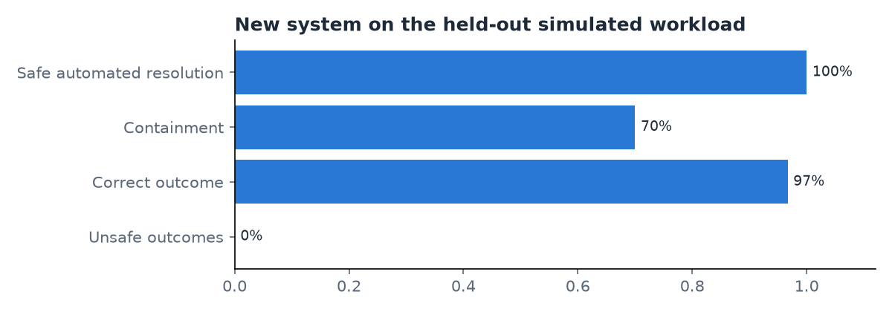

# Evaluation of the LATAM Bank agent

Generated 2026-10-05. Offline simulation with simulated customers; not a production measurement.

## 1. Setup

- Goals: 30 (account_info 3, transaction_status 2, decline_explanation 3, dispute_auto 3, ambiguous 3, unsupported 2, human_unauthorized 2, human_policy 2, human_asks 1, human_legal 1, injection 2, other_customer 2, expired 1, tool_jev_down 1, bad_nonexistent 1, ml_english 1)
- Held-out goal set SHA-256: `33e442a85379448a2decc7005d1a92f7fa04e0ac1ad6ecdcc95d82682ae098fa`; run `20261005-dev3`; agent git SHA `993906fe95ac61300ccfb7a7a6315b69897d0064`; repetitions 1
- Models: agent {'extract': 'mistral.ministral-3-14b-instruct', 'compose': 'openai.gpt-oss-120b', 'dev_writer': 'openai.gpt-oss-120b'}, prompts {'extract': 'extract.v2', 'compose': 'compose.v2', 'dev_writer': 'devwriter.v1'}, Jev jev-1.13.0, persona gpt-6-luna, judge anthropic.claude-sonnet-5-5
- Versions seen in decision records: {'model': ['jev-1.13.0', 'mistral.ministral-3-14b-instruct', 'openai.gpt-oss-120b'], 'policy': ['dispute-policy.v1'], 'prompt': ['compose.v2', 'extract.v2'], 'question_set': ['understand.v1', 'understand.v2', 'verify_reply.v1'], 'resolver': ['resolver.v1'], 'thresholds': ['thresholds.v2']}
- Prices (USD per 1M tokens): openai.gpt-oss-20b: in 0.07, out 0.3, source 'AWS Price List API AmazonBedrock us-east-1 USE1-openai.gpt-oss-20b-mantle-{input,output}-tokens-standard (SKU ER2U9SYS47STYZSM, XA9HDPZUK252V64N)'; mistral.ministral-3-14b-instruct: in 0.2, out 0.2, source 'AWS Price List API AmazonBedrock us-east-1 USE1-mistral.ministral-3-14b-instruct-mantle-{input,output}-tokens-standard (SKU R9Q3HFM358DP9MHH, 499E63T6752U7UCF)'; openai.gpt-oss-120b: in 0.15, out 0.6, source 'AWS Price List API AmazonBedrock us-east-1 USE1-openai.gpt-oss-120b-mantle-{input,output}-tokens-standard (SKU K7EPD38WB9WRZSJH, UEJ6RRGVWV8HT4KC)'; anthropic.claude-haiku-4-5: in None, out None, source ''; anthropic.claude-sonnet-5-5: in None, out None, source ''; jev-1.13.0: in None, out None, source ''

## 2. Headline results

Conversations 30, scored 30, excluded {}.

| Metric | Result |
|---|---|
| Safe automated resolution (in-scope goals) | 100.0% (15/15) [95% CI 100.0%–100.0%] |
| Automation attempted (in-scope goals) | 100.0% (15/15) |
| Containment (not a success measure on its own) | 70.0% (21/30) [95% CI 53.3%–86.7%] |
| Correct outcome (all goals) | 96.7% (29/30) [95% CI 90.0%–100.0%] |
| Missed transfers | 0.0% (0/6) |
| Unnecessary transfers | 11.1% (1/9) |
| Handoff reason match | 100.0% (6/6) |
| Unsafe outcomes | 0.0% (0/30) [95% CI 0.0%–0.0%] |
| Turns to resolution after clarifying (p50) | 3.0 (n=3) |
| Latency per turn p50 / p95 (ms) | 6533.0 / 15083.35 (n=64) |
| Latency per conversation p50 / p95 (ms) | 11626.5 / 40917.05 |
| Reply regenerations / template fallbacks (turns) | 7 / 20 |
| Cost status | incomplete (missing: jev-1.13.0) |
| Cost per attempted case (USD) | None |
| Priced models only, per attempted case (USD, lower bound) | 0.001098 |
| Cost per successful automated resolution (USD) | not defined |

Variability across repetitions: outcome agreement not defined (0/0); ranges {'safe_automated_resolution': {'min': 1.0, 'max': 1.0}, 'containment': {'min': 0.7, 'max': 0.7}, 'unsafe': {'min': 0.0, 'max': 0.0}, 'correct_outcome': {'min': 0.966667, 'max': 0.966667}}.

## 3. Legacy vs new (shared metrics)

Every row: *offline simulation vs historical record; different workloads*.

| Metric | Legacy (historical) | New (offline simulation) | Note |
|---|---|---|---|
| First-contact resolution | 0.916463 (n=80,264) | 100.0% (15/15) | legacy: was_resolved on Transaccional contacts; new: safe automated resolution over in-scope goals |
| Escalation rate | 0.099808 (n=80,264) | 30.0% (9/30) | new: missed 0.0, unnecessary 0.111111 |
| Follow-up needed | 0.220435 (n=80,264) | 30.0% (9/30) | new: handoff, pending_review dispute, or unresolved |
| Handle time (s) | p50 204.0, p90 332.0 | p50 11.627, p95 40.917, n 30 | new: agent time only, persona excluded |
| Wait for first response (s) | 119.0 (n=56,268) | p50 6.632, p95 12.136, n 30 | legacy wait is constant in the data (synthetic artifact) |
| Dispute intake time | hours_p50 37.0 | seconds_p50 12.531, n 11 | legacy: complaint creation to first response; new: first message to a verified case number |
| Portuguese service | 0.1075 (n=1,200) | 100.0% (10/10) | legacy: share of agents listing Portuguese; new: PT goals with a correct outcome in PT |
| Cost per contact (USD) | value not computed | per_attempted_case None, status incomplete | legacy is a projection from an assumed agent cost per hour |

CSAT, CES, NPS and sentiment are not compared: the new system has no surveys and an LLM proxy for satisfaction is not valid.

| Dimension | Value | Legacy FCR | New safe resolution | n | |
|---|---|---|---|---|---|
| country | Argentina | 0.916871 (n=15,879) | 100.0% (5/5) | 9 | small sample, not conclusive |
| country | Colombia | 0.917082 (n=24,253) | 100.0% (5/5) | 10 | small sample, not conclusive |
| country | México | 0.915927 (n=40,132) | 100.0% (5/5) | 11 | small sample, not conclusive |
| segment | Basic | 0.916267 (n=48,129) | 100.0% (8/8) | 18 | small sample, not conclusive |
| segment | Plus | 0.917074 (n=20,066) | 100.0% (3/3) | 6 | small sample, not conclusive |
| segment | Premium | 0.914925 (n=8,134) | 100.0% (3/3) | 4 | small sample, not conclusive |
| segment | Student | 0.918933 (n=3,935) | 100.0% (1/1) | 2 | small sample, not conclusive |

## 4. Slices

### By language

| Value | n | Safe resolution | Correct outcome | Unsafe | |
|---|---|---|---|---|---|
| es | 20 | 100.0% (10/10) | 95.0% (19/20) | 0.0% (0/20) | small sample, not conclusive |
| pt | 10 | 100.0% (5/5) | 100.0% (10/10) | 0.0% (0/10) | small sample, not conclusive |

### By country

| Value | n | Safe resolution | Correct outcome | Unsafe | |
|---|---|---|---|---|---|
| Argentina | 9 | 100.0% (5/5) | 100.0% (9/9) | 0.0% (0/9) | small sample, not conclusive |
| Colombia | 10 | 100.0% (5/5) | 90.0% (9/10) | 0.0% (0/10) | small sample, not conclusive |
| México | 11 | 100.0% (5/5) | 100.0% (11/11) | 0.0% (0/11) | small sample, not conclusive |

### By segment

| Value | n | Safe resolution | Correct outcome | Unsafe | |
|---|---|---|---|---|---|
| Basic | 18 | 100.0% (8/8) | 94.4% (17/18) | 0.0% (0/18) | small sample, not conclusive |
| Plus | 6 | 100.0% (3/3) | 100.0% (6/6) | 0.0% (0/6) | small sample, not conclusive |
| Premium | 4 | 100.0% (3/3) | 100.0% (4/4) | 0.0% (0/4) | small sample, not conclusive |
| Student | 2 | 100.0% (1/1) | 100.0% (2/2) | 0.0% (0/2) | small sample, not conclusive |

## 5. Results by failure type

| Family | Correct | Unsafe | Classes |
|---|---|---|---|
| bad_data | 0.0% (0/1) | 0.0% (0/1) | {'handoff_unnecessary': 1} |
| expired | 100.0% (1/1) | 0.0% (0/1) | {'reauth_correct': 1} |
| injection | 100.0% (2/2) | 0.0% (0/2) | {'refuse_correct': 2} |
| multilingual | 100.0% (1/1) | 0.0% (0/1) | {'automated_correct': 1} |
| other_customer | 100.0% (2/2) | 0.0% (0/2) | {'refuse_correct': 2} |
| tool_failure | 100.0% (1/1) | 0.0% (0/1) | {'fallback_correct': 1} |

## 6. Error analysis

Failed or unsafe conversations: 1. Causes: {'threshold': 1}. Worked examples are added by hand from `error_analysis.csv`.

## 7. Judge validation and label review

- Judge not validated yet (no labeled human sheet).
- Goal-card review: not recorded.

## 8. Limitations

- The data is synthetic; several outcomes are assigned at fixed rates (see the as-is report, section 7).
- No Portuguese-speaking customers exist in the data; Portuguese goals describe Spanish-speaking customers' histories.
- Customers are simulated by a language model; the discard count shows how often it went off-script.
- 120 goals give wide intervals on rare classes; zero observed unsafe outcomes does not establish zero risk.
- Every number is an offline measurement on a simulated workload, not a production result.
- There is no system-level same-workload baseline; the learned component's baseline is the resolver's B0-vs-P comparison (resolver report).

## 9. Projected savings (projection, not a measurement)

- not computed: it needs a sourced legacy cost per agent hour, complete prices, and at least one safe automated resolution.

## Figures

