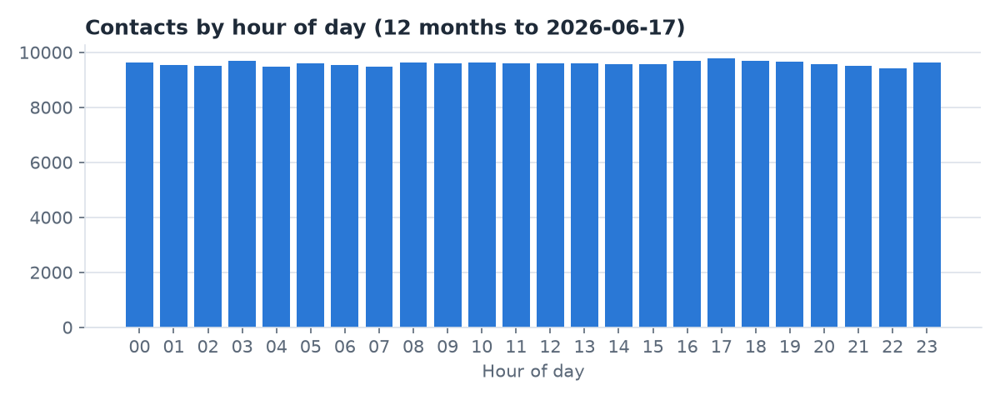
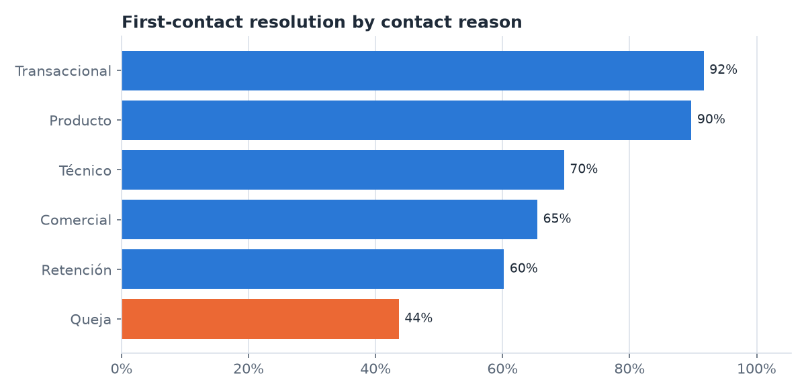
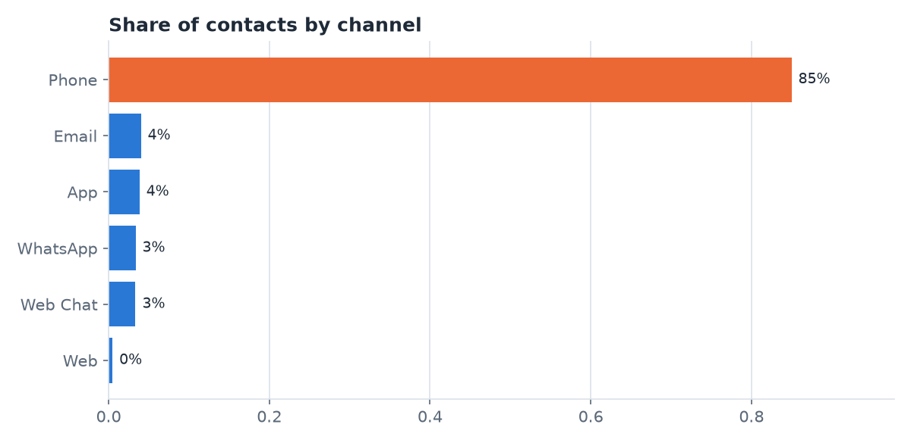

# As-is diagnosis of the LATAM Bank contact center

Generated 2026-10-05 from `data/data/`, window 2025-06-17 → 2026-06-17 (inclusive). Every finding is tagged **evidence** or **synthetic artifact**; synthetic artifacts are reported but never used to argue for the new system. Reconciliation with the curated marts: **reconciled**.

## 1. Demand

- In-scope contacts per month (Transaccional interactions plus dispute complaints): 7,372 (n=88,463) · evidence
- Phone share of all contacts: 85.0% (n=230,196) · evidence
- Contacts per hour of day range from 9,421 to 9,777: flat across the day and night, which a real contact center doesn't show (uniform generator) · synthetic artifact

| Reason | Share of contacts |
|---|---|
| Transaccional | 34.9% (n=230,196) |
| Producto | 22.0% (n=230,196) |
| Queja | 17.1% (n=230,196) |
| Técnico | 15.0% (n=230,196) |
| Comercial | 8.1% (n=230,196) |
| Retención | 3.0% (n=230,196) |

## 2. Service quality today

| Reason | FCR | Escalated | Follow-up | Handle p50 (s) | Handle p90 (s) | Wait p50 (s) | Negative sentiment |
|---|---|---|---|---|---|---|---|
| Transaccional | 91.6% (n=80,264) | 10.0% (n=80,264) | 22.0% (n=80,264) | 204 (n=69,040) | 332 (n=69,040) | 119 (n=56,268) | 0.0% (n=80,264) |
| Producto | 89.7% (n=50,602) | 10.0% (n=50,602) | 23.7% (n=50,602) | 262 (n=43,488) | 378 (n=43,488) | 119 (n=35,473) | 19.5% (n=50,602) |
| Queja | 43.6% (n=39,300) | 10.0% (n=39,300) | 62.8% (n=39,300) | 431 (n=33,824) | 607 (n=33,824) | 120 (n=27,673) | 34.7% (n=39,300) |
| Técnico | 69.7% (n=34,590) | 10.3% (n=34,590) | 40.7% (n=34,590) | 360 (n=29,731) | 499 (n=29,731) | 119 (n=24,228) | 34.9% (n=34,590) |
| Comercial | 65.4% (n=18,552) | 9.8% (n=18,552) | 44.3% (n=18,552) | 541 (n=15,830) | 748 (n=15,830) | 120 (n=12,774) | 34.9% (n=18,552) |
| Retención | 60.2% (n=6,888) | 9.3% (n=6,888) | 49.3% (n=6,888) | 479 (n=5,883) | 665 (n=5,883) | 120 (n=4,844) | 34.7% (n=6,888) |

- Escalation rate · synthetic artifact: 6 reason buckets; range 0.010
- Wait time · synthetic artifact: 6 reason x channel slices; median wait 119-120s (spread 1s); individual waits p10 41s, p90 197s
- CSAT resolved 3.00 (n=32,628) vs unresolved 2.00 (n=9,980) · synthetic artifact: mean CSAT resolved 3.00 vs unresolved 2.01 (gap 0.99); largest range across reasons within a status 0.080
- Transaccional sentiment · synthetic artifact: Neutral is 100.0% of 80,264
- Surveys linked to an interaction: 100.0% (n=71,359) · evidence

## 3. Capacity

- Agents: 1,200 (n=1,200); listing Portuguese: 10.8% (n=1,200) · evidence
- Agents' `total_monthly_interactions` attribute averages 453 (n=1,200) · synthetic artifact: it does not reconcile with the logged contacts
- Logged contacts per agent per month: 16.0 (n=230,196) · evidence

| Shift (assumed hours) | Agents | Contacts per agent in the window |
|---|---|---|
| Morning | 398 (n=1,200) | 192.6 (n=76,646) |
| Afternoon | 418 (n=1,200) | 184.3 (n=77,049) |
| Night | 181 (n=1,200) | 422.7 (n=76,501) |

Shift hours are an assumption (Morning 06–13, Afternoon 14–21, Night 22–05); the data has no schedule. The per-shift load comes from flat hourly demand and these assumed hours, so it is not evidence.

## 4. Dispute handling today

- Dispute complaints (Cargo no reconocido, Cobro indebido): 8,199 (n=8,199)
- Median time to first response: 37.0 h (n=5,022) · evidence
- Median time to resolution: 15.5 days (n=1,886) · evidence
- SLA breached: 20.1% (n=8,199) · synthetic artifact: 15 category x priority buckets; range 0.043
- Still Open or In Process: 69.8% (n=8,199) · evidence
- Received through App: 10.0% (n=8,199)
- Received through Branch: 4.0% (n=8,199)
- Received through Call Center: 50.7% (n=8,199)
- Received through Email: 19.9% (n=8,199)
- Received through Regulator: 1.1% (n=8,199)
- Received through Web: 14.5% (n=8,199)

## 5. Digital channel

Descriptive only.
- Click events per month: 101,200 (n=1,214,400)
- Error events per month: 10,116 (n=121,394)
- FormSubmit events per month: 16,902 (n=202,827)
- Login events per month: 68,674 (n=824,090)
- Logout events per month: 68,634 (n=823,604)
- PageView events per month: 168,821 (n=2,025,854)
- Purchase events per month: 6,796 (n=81,550)

## 6. Unusable sources

- Transcripts: 42 (n=57,589) distinct customer texts; 95.2% (n=57,589) tagged `consulta_general` · synthetic artifact. They are not used as labels.

## 7. Data limits and synthetic artifacts

| Check | Holds | Evidence |
|---|---|---|
| escalation_flat | yes | 6 reason buckets; range 0.010 |
| sla_flat | yes | 15 category x priority buckets; range 0.043 |
| wait_constant | yes | 6 reason x channel slices; median wait 119-120s (spread 1s); individual waits p10 41s, p90 197s |
| csat_by_resolution | yes | mean CSAT resolved 3.00 vs unresolved 2.01 (gap 0.99); largest range across reasons within a status 0.080 |
| transactional_sentiment_constant | yes | Neutral is 100.0% of 80,264 |
| no_pt_customers | yes | countries: México 74,907, Colombia 45,251, Argentina 29,842 |
| transcripts_templated | yes | 42 distinct texts in 57,589 rows |

## 8. Fairness reference

Transaccional interactions only.

| Dimension | Value | FCR | Handle p50 (s) |
|---|---|---|---|
| accent | argentine | 91.6% (n=11,179) | 203 (n=9,623) |
| accent | colombian | 91.7% (n=16,976) | 206 (n=14,585) |
| accent | mexican | 91.5% (n=27,968) | 204 (n=24,070) |
| accent | unknown | 91.8% (n=24,141) | 204 (n=20,762) |
| country | Argentina | 91.7% (n=15,879) | 204 (n=13,641) |
| country | Colombia | 91.7% (n=24,253) | 205 (n=20,850) |
| country | México | 91.6% (n=40,132) | 204 (n=34,549) |
| segment | Basic | 91.6% (n=48,129) | 204 (n=41,446) |
| segment | Plus | 91.7% (n=20,066) | 204 (n=17,224) |
| segment | Premium | 91.5% (n=8,134) | 205 (n=6,953) |
| segment | Student | 91.9% (n=3,935) | 206 (n=3,417) |

## 9. Reconciliation with the curated marts

Same window (`process_date` 2025-06-17 → 2026-06-17) counted in `LATAM_BANK.CURATED` by `analysis/asis/reconcile.sql` (read-only); tolerance 0.1%.

| Metric | As-is (raw drop) | Curated mart | Relative difference | Within tolerance |
|---|---|---|---|---|
| interactions_n | 230,196 | 230,196 | 0.0% | yes |
| complaints_n | 22,552 | 22,552 | 0.0% | yes |
| transaccional_fcr | 0.916463 | 0.916463 | 0.0% | yes |
| disputes_n | 8,199 | 8,199 | 0.0% | yes |
| cargo_no_reconocido_n | 4,193 | 4,193 | 0.0% | yes |

Why they match: quarantine rows: 0; raw complaints rows: 22,552; raw interactions rows: 230,196.

## Figures

